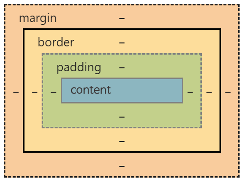

## 박스모델이란?

### 1. 정의

- **박스모델(Box Model)** 은  
  **HTML 요소가 웹 페이지에서 차지하는 공간과 레이아웃을 계산하는 기본 원리**입니다.
- 모든 HTML 요소는 박스 형태로 렌더링되며,  
  **박스모델은 각 요소의 크기와 여백을 어떻게 계산할지 정의**합니다.

---

### 2. 구성 요소

박스모델은 다음 4가지로 구성됩니다.

1. **Content(콘텐츠 영역)**
   - 실제 내용(텍스트, 이미지 등)이 들어가는 부분
2. **Padding(패딩)**
   - 콘텐츠와 테두리(border) 사이의 내부 여백
3. **Border(테두리)**
   - 요소를 감싸는 선
4. **Margin(마진)**
   - 요소 바깥쪽의 외부 여백(다른 요소와의 거리)

---

### 3. 시각적 구조

---

### 4. 박스의 전체 크기 계산

- 기본적으로  
  **전체 너비(width) = content + padding + border + margin**
- CSS의 `box-sizing` 속성에 따라 계산 방법이 달라질 수 있음
  - `box-sizing: content-box` (기본값): width는 content만 의미
  - `box-sizing: border-box`: width에 padding, border 포함

---

### 5. 요약

- **박스모델**은 웹에서 요소의 크기, 여백, 레이아웃을 결정하는 핵심 개념
- 4가지(콘텐츠, 패딩, 보더, 마진)로 이루어져 있고,  
  CSS로 각각을 제어할 수 있다.
